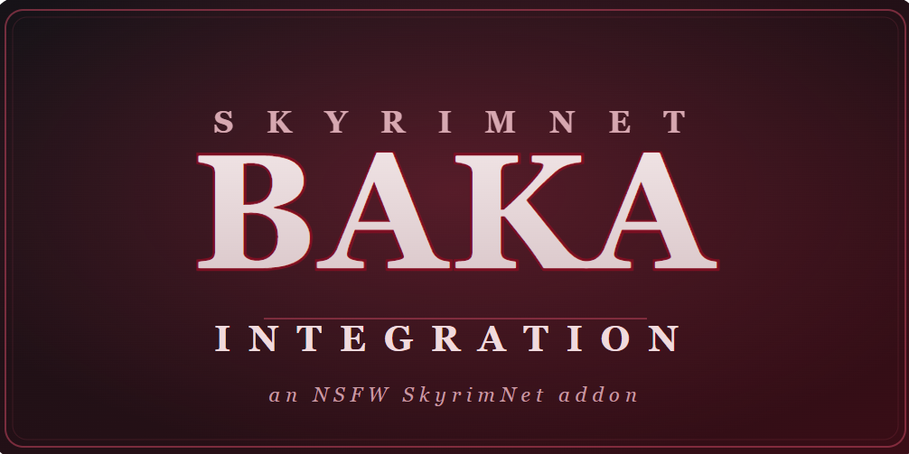

  

<h1 align="center">SkyrimNet Baka Integration — NSFW Interactions</h1>

  <em>LLM-driven physical &amp; intimate interactions and facial expressions for
  <a href="https://www.nexusmods.com/skyrimspecialedition/mods/146908">SkyrimNet</a>.</em>

> ⚠️ **Adult content (18+).** This addon adds non-consensual / NSFW interactions. Use responsibly.

---

## What it does

This is an addon for **SkyrimNet** — it lets the AI driving your NPCs choose, in context, to
perform physical and intimate actions and react with facial expressions during roleplay. It hooks
into SkyrimNet through custom **actions, triggers, and decorators**.

*(add screenshots / a short demo clip here)*

## What to expect

Once everything is installed, your NPCs can — when it fits the scene and their personality —
**start or be drawn into these interactions on their own**, decided by SkyrimNet's model rather than
menus or hotkeys. Expect *emergent, unscripted* moments: a dominant NPC spanking someone bent over a
table, a captor escalating on a defeated victim, faces shifting to fear or pain in the moment, or
characters striking fitting body language while they speak.

- It is **player- and NPC-targetable** and leans **dark / non-consensual** by design; the tone follows
  the characters and context you set.
- Nothing fires at random — give characters fitting personalities and the LLM drives the rest. Master
  toggles and an intensity slider let you dial it back.
- It needs several frameworks and an animation pack (see **Requirements**) — without them, the relevant
  pieces simply do nothing rather than break.

## Features

- **Physical interactions** the LLM picks contextually:
  - Spanking — butt / face / breast slaps, with accumulating skin marks &amp; tattoos, impact sounds, and reactions
  - Grab hold, choke hold, struggle — paired animations with a resist QTE
  - Drug-food &amp; drunk exploit (incapacitate), womb hit
  - Forced kiss, fondle, touch / suck breasts, oral, examine / inspect
- **Escalation → SexLab** aggressive scenes, with defeat / bleedout &amp; recovery
- **Facial expressions** — happy / angry / afraid / sad / pained / surprised / confused
  - LLM-triggerable *and* automatic in-scene (fear in a struggle, pain on a choke / bleedout, sadness while crying)
  - Adjustable intensity
- **Reactions** — animated tears, face / tear overlays that survive sex scenes, cover-self after a spank
- **PrismaUI menus** for choosing interactions and setting up encounters

## Requirements

**Core**
- SkyrimNet (+ SKSE64, Address Library)
- [PrismaUI](https://www.nexusmods.com/skyrimspecialedition/mods/148718)
- PapyrusUtil, MfgFix, powerofthree's Papyrus Extender
- SlaveTats
- [Emotional Tears Effect (EmoTears)](https://www.nexusmods.com/skyrimspecialedition/mods/122296) — for animated tears
- [Baka Motion Data Pack](https://www.loverslab.com/files/file/26992-baka-motion-data-pack/) — the paired interaction animations; build with **FNIS / Nemesis / Pandora**

**Optional (degrades gracefully if absent)**
- Acheron, Flash Games – Struggling QTE, Dynamic Feminine Female Modesty Animations OAR

## Installation

1. Install all requirements above.
2. Install this mod with your mod manager (MO2/Vortex), let it win conflicts for its own files.
3. Run **FNIS / Nemesis / Pandora** to generate the bundled paired animations.
4. Launch once so SkyrimNet loads the bundled action configs (`SKSE/Plugins/SkyrimNet/config/`).

## Configuration

MCM (and script properties) expose toggles:
- Scene framework selector (Auto / SexLab / OStim)
- `bExpressionsEnabled` — facial-expression master switch
- `fExpressionIntensity` (0.0–1.0) — how strong faces look
- spank cooldowns, male-target / player-target allowances, animated tears, etc.

## Notes & tips

- Run **Pandora / FNIS / Nemesis** after installing, or the paired animations will T-pose.
- Faces feel too strong or too flat? Adjust **`fExpressionIntensity`** (0.0–1.0) — there's no single right value, it depends on your follower/face setup.
- Actions are chosen by SkyrimNet's model **in context** — give your characters fitting personalities and dispositions, and the scene mostly drives itself. The action descriptions tell the model *when* each one fits.
- After updating, **reload SkyrimNet's config** (or restart) so new/changed actions are picked up.
- This addon contains explicit and **non-consensual** themes. It is fiction for adult roleplay — use it within your own comfort and local laws.

## Credits

- **SkyrimNet** — the framework this builds on
- Paired interaction animations — *Babo / SLAP* animation authors
- Cover-self reaction — driven by the *Dynamic Feminine Female Modesty Animations OAR* mod (Kahvipannu84 / Gunslicer); install it for that feature (no animations are bundled here)
- Facial-expression morph values — [Additional Expressions Project](https://www.nexusmods.com/skyrimspecialedition/mods/72337) (optional; the values are baked in, so it isn't required at runtime)
- Frameworks — SexLab, PrismaUI, PapyrusUtil, MfgFix, po3 Papyrus Extender, SlaveTats, EmoTears4NPCs, Acheron

> Bundled third-party animations/assets remain the property of their original authors and are
> included per their permissions. If you are an author and want something removed, open an issue.

## Links

- Nexus: **[add link]**
- Discord: **[add link]**
